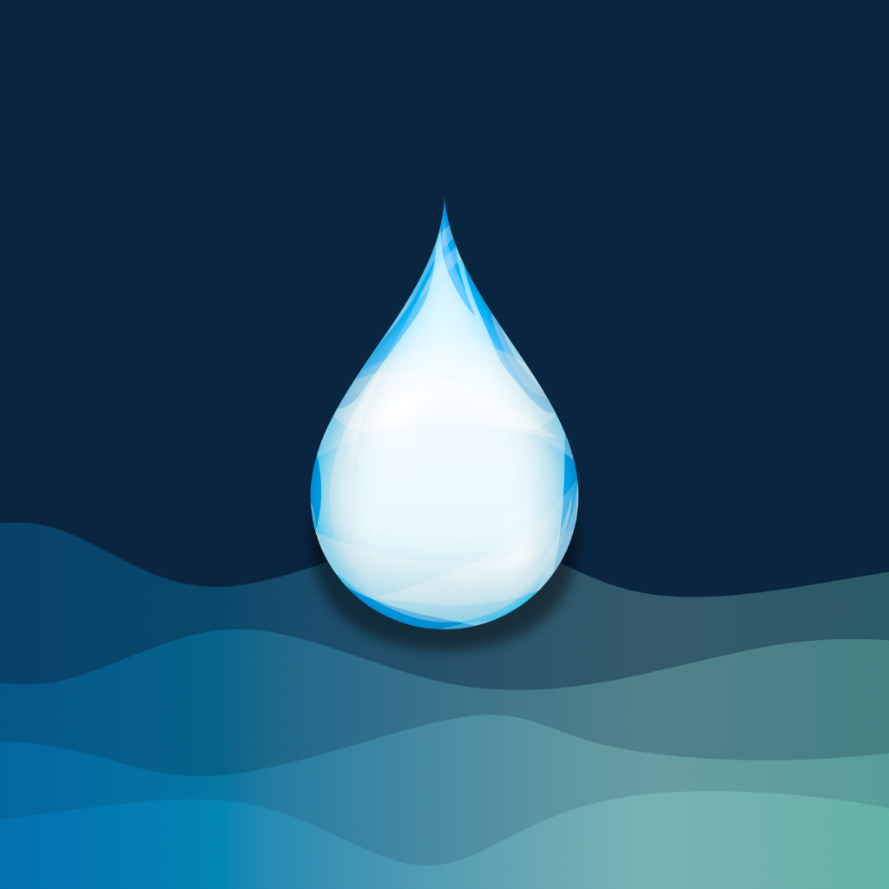

# Hydra 🚰
<p align="center">
  
</p>

**Hydra** is a comprehensive React Native water tracking app that helps you maintain optimal hydration through smart features, gamification, and personalized insights. Built with Expo for seamless cross-platform experience.

---

## ✨ Features

### 🏠 Core Tracking
- **Smart Water Logging**: Easy-to-use interface with customizable drink options
- **Progress Visualization**: Beautiful animated water drop progress indicator
- **Daily Goals**: Personalized hydration targets based on your profile
- **Real-time Statistics**: Track your daily progress and intake history

### 🌤️ Weather-Based Insights
- **Weather Integration**: Real-time weather data with hydration recommendations
- **Smart Adjustments**: Automatic goal adjustments based on temperature, humidity, and conditions
- **Location-Aware**: Personalized advice based on your local weather
- **Activity Correlation**: Recommendations that consider your activity level

### 🎮 Gamification & XP System
- **Experience Points**: Earn XP for every hydration action
- **20-Level System**: Progress through levels with meaningful rewards
- **Achievement Tracking**: Unlock milestones and celebrate progress
- **Unlockable Themes**: Earn beautiful new app themes through gameplay
- **Streak Rewards**: Bonus XP for maintaining consistent habits

### 🛡️ Streak Management
- **Streak Tracking**: Monitor your consecutive hydration days
- **Streak Safeguard**: Restore broken streaks once per month
- **Motivation System**: Personalized encouragement based on progress
- **Historical Analysis**: View detailed streak statistics and patterns

### 🔔 Smart Notifications
- **Intelligent Reminders**: Adaptive notifications based on your schedule
- **Custom Reminders**: Create personalized notification schedules
- **Day-Specific Settings**: Different reminders for weekdays/weekends
- **Weather-Aware**: Notifications adapt to weather conditions

### 🎤 Voice Logging
- **Voice-to-Text**: Log water intake using natural speech
- **Smart Parsing**: Automatically detects drink type and amount
- **XP Bonus**: Extra experience points for voice logging
- **Quick & Convenient**: Hands-free water tracking

### ♿ Accessibility
- **Large Font Mode**: Enhanced readability for visually impaired users
- **High Contrast Mode**: Improved visibility in all lighting conditions
- **Screen Reader Support**: Full VoiceOver and TalkBack compatibility
- **Voice Logging**: Alternative input method for motor impairments

### 📊 Advanced Analytics
- **Detailed History**: Comprehensive tracking with FlatList performance
- **Period Filtering**: View data by week, month, or all time
- **Progress Statistics**: Success rates, averages, and trends
- **Visual Progress Bars**: Clear representation of daily achievements

### 🎨 Customization
- **Multiple Themes**: Unlock themes through achievements
- **Dark/Light Mode**: System-responsive theme switching
- **Profile Customization**: Personalize your hydration experience
- **Flexible Goals**: Adjust targets based on your needs

---

## 🚀 Getting Started

### Prerequisites

- [Node.js](https://nodejs.org/) (v16 or higher)
- [Expo CLI](https://docs.expo.dev/get-started/installation/)
- [Expo Go app](https://expo.dev/client) on your mobile device
- [Yarn](https://classic.yarnpkg.com/) or [npm](https://www.npmjs.com/)

### Installation

1. **Clone the repository:**
   ```bash
   git clone https://github.com/amanr11/hydra.git
   cd hydra
   ```

2. **Install dependencies:**
   ```bash
   npm install
   # or
   yarn install
   ```

3. **Start the development server:**
   ```bash
   npx expo start
   ```

4. **Open in Expo Go:**
   - Scan the QR code with the Expo Go app on your phone
   - Or press 'i' for iOS simulator / 'a' for Android emulator

---

## 🎯 Usage

### Getting Started
1. **Set Your Profile**: Enter your name, weight, and activity level
2. **Configure Goals**: Set your daily hydration target (default: 2000ml)
3. **Enable Notifications**: Allow push notifications for smart reminders
4. **Start Tracking**: Log your first drink and begin your hydration journey!

### Smart Features
- **Weather Insights**: Check the weather panel for personalized recommendations
- **Voice Logging**: Tap the microphone button and say "I drank 300ml of water"
- **Streak Safeguard**: Use once per month to restore missed days
- **Custom Reminders**: Create your own notification schedule
- **XP & Levels**: Watch your experience grow with every action

### Tips for Success
- 🌅 **Start Early**: Log your first glass right after waking up
- 📱 **Use Voice**: Try voice logging for quick, hands-free tracking
- 🔔 **Smart Reminders**: Let the app remind you based on your schedule
- 🌡️ **Weather Aware**: Pay attention to weather-based recommendations
- 🏆 **Track Streaks**: Aim for consistency over perfection

---

## 🏗️ Architecture

### Services Layer
- **StorageService**: Centralized AsyncStorage management
- **NotificationService**: Smart reminder system
- **WeatherService**: Weather API integration
- **XPService**: Experience points and leveling
- **StreakService**: Streak calculation and safeguard

### Component Structure
- **Screens**: Main app screens with navigation
- **Components**: Reusable UI components with PropTypes
- **Hooks**: Custom hooks for data management
- **Services**: Business logic and external integrations

### Key Technologies
- **React Native**: Cross-platform mobile development
- **Expo**: Development platform and build tools
- **AsyncStorage**: Local data persistence
- **React Navigation**: Screen navigation
- **Expo Notifications**: Push notification system
- **OpenWeather API**: Weather data integration

---

## 📱 Screenshots

<!-- Add screenshots here when available -->
*Screenshots will be added as the app development progresses*

---

## 🔮 Upcoming Features

- 🔥 **Firebase Integration**: Cloud sync and backup
- 👥 **Social Challenges**: Compete with friends and family
- 🤖 **AI Hydration Coach**: Personalized weekly insights
- 🏆 **Extended Achievements**: More unlockable content
- 📈 **Advanced Analytics**: Detailed health correlations
- 🌍 **Community Features**: Global leaderboards and challenges

---

## 🤝 Contributing

We welcome contributions! Here's how you can help:

1. **Fork the repository**
2. **Create a feature branch** (`git checkout -b feature/amazing-feature`)
3. **Commit your changes** (`git commit -m 'Add amazing feature'`)
4. **Push to the branch** (`git push origin feature/amazing-feature`)
5. **Open a Pull Request**

### Development Guidelines
- Follow the existing code style and patterns
- Add PropTypes for all component props
- Include error handling for async operations
- Test on both iOS and Android
- Update documentation for new features

---

## 📄 License

This project is licensed under the MIT License - see the [LICENSE](LICENSE) file for details.

---

## 👨‍💻 Author

**Aman Raj** - [amanr11](https://github.com/amanr11)

---

## 🙏 Acknowledgments

- Weather data provided by [OpenWeather API](https://openweathermap.org/)
- Icons and illustrations from [Expo Vector Icons](https://icons.expo.fyi/)
- Inspiration from the hydration and wellness community

---

## 📞 Support

If you encounter any issues or have questions:

1. **Check the Issues**: Browse existing [GitHub Issues](https://github.com/amanr11/hydra/issues)
2. **Create New Issue**: Report bugs or request features
3. **Documentation**: Refer to this README and inline code comments

---

<p align="center">
  Made with 💧 and ❤️ for better hydration habits
</p>
