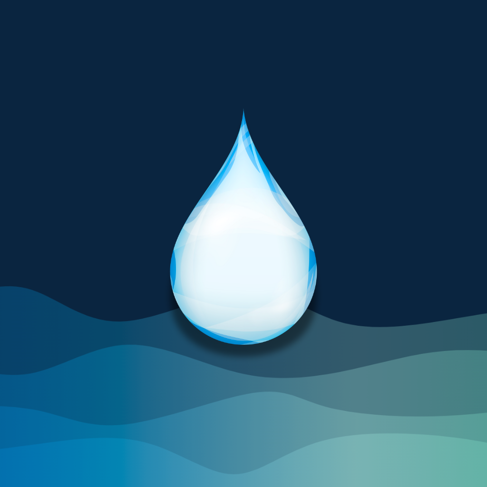

# Hydra 🚰
<p align="center">
  
</p>

**Hydra** is a comprehensive React Native water tracking app that helps you maintain optimal hydration through smart features, gamification, and personalized insights. Built with Expo for seamless cross-platform experience.

---

## ✨ Features

### 🏠 Core Tracking
- **Smart Water Logging**: Easy-to-use interface with customizable drink options
- **Progress Visualization**: Beautiful animated water drop progress indicator
- **Daily Goals**: Personalized hydration targets based on your profile
- **Real-time Statistics**: Track your daily progress and intake history

### 🎵 Sound Effects & Haptics
- **Drink Added**: Soft click sound + light haptic on every drink
- **Halfway Milestone**: Chime + medium haptic when crossing 50% of your goal
- **Goal Complete**: Celebratory chord + success haptic at 100%
- **Level Up**: Special sound when you gain a new XP level
- **Toggleable**: Enable/disable sounds and haptics separately in Settings

### 🌤️ Weather-Based Insights
- **Weather Integration**: Real-time weather data with hydration recommendations
- **Smart Adjustments**: Automatic goal adjustments based on temperature, humidity, and conditions

### 🎮 Gamification & XP System
- **Experience Points**: Earn XP for every hydration action
- **20-Level System**: Progress through levels with meaningful rewards
- **Achievement Tracking**: Unlock milestones and celebrate progress
- **Streak Rewards**: Bonus XP for maintaining consistent habits

### 🔔 Smart Notifications
- **Intelligent Reminders**: Adaptive notifications based on your schedule
- **Custom Reminders**: Create personalized notification schedules

### 🔐 Authentication (optional)
- **Firebase Auth**: Email/password sign up with email verification
- **Session Persistence**: Stay signed in across app restarts
- **Sign In Gate**: Unverified emails are blocked until verified
- **Re-send verification**: Easily resend if the email was missed

---

## 🚀 Getting Started

### Prerequisites

- [Node.js](https://nodejs.org/) (v16 or higher)
- [Expo CLI](https://docs.expo.dev/get-started/installation/)
- [Expo Go app](https://expo.dev/client) on your mobile device
- [Yarn](https://classic.yarnpkg.com/) or [npm](https://www.npmjs.com/)

### Installation

1. **Clone the repository:**
   ```bash
   git clone https://github.com/amanr11/hydra.git
   cd hydra
   ```

2. **Install dependencies:**
   ```bash
   npm install
   ```

3. **Start the development server:**
   ```bash
   npx expo start
   ```

4. **Open in Expo Go:**
   - Scan the QR code with the Expo Go app on your phone
   - Or press 'i' for iOS simulator / 'a' for Android emulator

---

## 🔐 Firebase Authentication Setup (optional)

Authentication is **disabled by default** — the app works fully without it. If you want email/password sign-in with email verification, follow these steps:

### 1. Create a Firebase project

1. Go to [Firebase Console](https://console.firebase.google.com/)
2. Click **Add project** and follow the setup wizard
3. In the project dashboard, click **Add app → Web**
4. Copy the config object shown

### 2. Enable Email/Password authentication

1. In Firebase Console, go to **Authentication → Sign-in method**
2. Enable **Email/Password**
3. *(Optional)* Enable **Email link (passwordless sign-in)* if desired

### 3. Configure the app

Open `firebase.js` and replace the placeholder values with your actual credentials:

```js
const firebaseConfig = {
  apiKey: "your-actual-api-key",
  authDomain: "your-project.firebaseapp.com",
  projectId: "your-project-id",
  storageBucket: "your-project.appspot.com",
  messagingSenderId: "123456789",
  appId: "1:123456789:web:abcdef"
};
```

> ⚠️ **Never commit real credentials to a public repository.**  
> Add `firebase.js` to `.gitignore` if your repository is public, or use environment variables.

### 4. Environment variables (recommended for CI/CD)

For production, use Expo's public env variable approach:

1. Rename `firebase.js` config values to `process.env.EXPO_PUBLIC_*` variables
2. Create a `.env` file (already in `.gitignore`):
   ```
   EXPO_PUBLIC_FIREBASE_API_KEY=your-api-key
   EXPO_PUBLIC_FIREBASE_AUTH_DOMAIN=your-project.firebaseapp.com
   EXPO_PUBLIC_FIREBASE_PROJECT_ID=your-project-id
   EXPO_PUBLIC_FIREBASE_STORAGE_BUCKET=your-project.appspot.com
   EXPO_PUBLIC_FIREBASE_MESSAGING_SENDER_ID=123456789
   EXPO_PUBLIC_FIREBASE_APP_ID=1:123456789:web:abcdef
   ```

---

## 🎯 Usage

### Getting Started
1. **Set Your Profile**: Enter your name, weight, and activity level
2. **Configure Goals**: Set your daily hydration target (default: 2000ml)
3. **Enable Notifications**: Allow push notifications for smart reminders
4. **Start Tracking**: Log your first drink and begin your hydration journey!

### Settings
- **Sound Effects**: Toggle sounds for drink actions and milestones
- **Haptic Feedback**: Toggle vibration feedback
- **Notifications**: Configure smart and custom reminders
- **Units**: Switch between ml and oz
- **Dark Mode**: Toggle app theme

---

## 🏗️ Architecture

### Services Layer
- **StorageService**: Centralized AsyncStorage management
- **NotificationService**: Smart reminder system
- **WeatherService**: Weather API integration
- **XPService**: Experience points and leveling
- **StreakService**: Streak calculation and safeguard
- **SoundService**: Sound effects and haptic feedback
- **AuthService**: Firebase authentication helpers

### Component Structure
- **Screens**: Main app screens with navigation
- **Components**: Reusable UI components with PropTypes
- **Hooks**: Custom hooks for data management
- **Services**: Business logic and external integrations

### Key Technologies
- **React Native**: Cross-platform mobile development
- **Expo**: Development platform and build tools
- **expo-av**: Audio playback for sound effects
- **expo-haptics**: Haptic feedback
- **AsyncStorage**: Local data persistence
- **React Navigation**: Screen navigation
- **Expo Notifications**: Push notification system
- **Firebase Auth**: Optional email authentication

---

## 📱 Screenshots

<!-- Add screenshots here when available -->
*Screenshots will be added as the app development progresses*

---

## 🔮 Upcoming Features

- 👥 **Social Challenges**: Compete with friends and family
- 🤖 **AI Hydration Coach**: Personalized weekly insights
- 🏆 **Extended Achievements**: More unlockable content
- 📈 **Advanced Analytics**: Detailed health correlations
- 🌍 **Community Features**: Global leaderboards and challenges
- 🖼️ **Profile Picture**: Custom avatar with default on first login

---

## 🤝 Contributing

We welcome contributions! Here's how you can help:

1. **Fork the repository**
2. **Create a feature branch** (`git checkout -b feature/amazing-feature`)
3. **Commit your changes** (`git commit -m 'Add amazing feature'`)
4. **Push to the branch** (`git push origin feature/amazing-feature`)
5. **Open a Pull Request**

### Development Guidelines
- Follow the existing code style and patterns
- Add PropTypes for all component props
- Include error handling for async operations
- Test on both iOS and Android
- Update documentation for new features

---

## 📄 License

This project is licensed under the MIT License - see the [LICENSE](LICENSE) file for details.

---

## 👨‍💻 Author

**Aman Raj** - [amanr11](https://github.com/amanr11)

---

## 🙏 Acknowledgments

- Weather data provided by [OpenWeather API](https://openweathermap.org/)
- Icons and illustrations from [Expo Vector Icons](https://icons.expo.fyi/)
- Inspiration from the hydration and wellness community

---

## 📞 Support

If you encounter any issues or have questions:

1. **Check the Issues**: Browse existing [GitHub Issues](https://github.com/amanr11/hydra/issues)
2. **Create New Issue**: Report bugs or request features
3. **Documentation**: Refer to this README and inline code comments

---

<p align="center">
  Made with 💧 and ❤️ for better hydration habits
</p>

